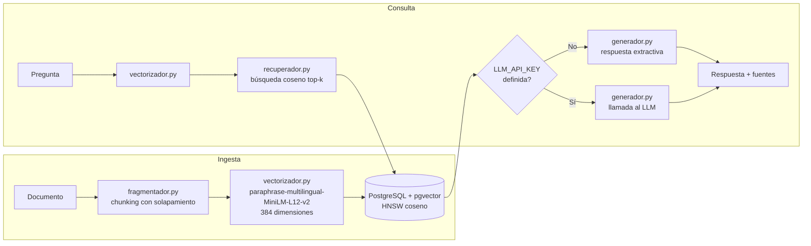

# rag-pipeline

API de recuperación aumentada por generación (RAG) sobre documentos en español, con almacenamiento vectorial en PostgreSQL y generación opcional mediante cualquier LLM compatible con la API de OpenAI.

<div align="center">


</div>

---

## Resumen

`rag-pipeline` expone dos operaciones principales a través de una API REST:

- **Ingesta**: recibe un documento de texto, lo divide en fragmentos con solapamiento, genera embeddings con un modelo multilingüe local y los persiste en PostgreSQL con la extensión pgvector.
- **Consulta**: vectoriza una pregunta en lenguaje natural, recupera los fragmentos más similares por distancia coseno y devuelve una respuesta junto con las fuentes.

El valor principal del proyecto es que **no depende de servicios de pago ni expone credenciales** para funcionar. El modo de generación extractiva cubre todos los casos de uso de recuperación sin necesidad de ninguna clave de API. Si se desea generación con lenguaje natural, basta con configurar tres variables de entorno.

---

## ¿Qué es RAG y por qué?

RAG (Retrieval-Augmented Generation, recuperación aumentada por generación) combina dos pasos:

1. **Recuperación**: dado un corpus de documentos, se buscan los fragmentos semánticamente más cercanos a una pregunta mediante vectores de alta dimensión y búsqueda por similitud.
2. **Generación**: los fragmentos recuperados se incluyen como contexto en el prompt de un modelo de lenguaje, que produce una respuesta fundamentada en ese contexto.

Esta arquitectura reduce las alucinaciones del modelo porque la respuesta queda anclada en fragmentos reales del corpus, y permite actualizar el conocimiento del sistema sin reentrenar ningún modelo.

---

## Arquitectura



---

## Componentes

| Módulo | Responsabilidad |
|---|---|
| `rag/fragmentador.py` | Divide el texto en fragmentos de 500 caracteres con solapamiento de 80 |
| `rag/vectorizador.py` | `VectorizadorST` genera embeddings reales; `VectorizadorFalso` sirve para pruebas rápidas sin GPU |
| `rag/almacen.py` | Persiste documentos y fragmentos en PostgreSQL; ejecuta la búsqueda coseno con pgvector |
| `rag/recuperador.py` | Orquesta la vectorización de la pregunta y la llamada al almacén |
| `rag/generador.py` | Devuelve respuesta extractiva o llama al LLM configurado |
| `rag/api.py` | FastAPI con los endpoints `/salud`, `/ingerir` y `/consultar` |
| `rag/bd.py` | Conexión a PostgreSQL mediante `PG_DSN` |
| `seed/01_esquema.sql` | DDL: tablas `documentos` y `fragmentos`, índice HNSW coseno |
| `ingerir_demo.py` | Carga el corpus de demostración desde `datos/corpus.json` |

---

## Cómo ejecutarlo

### 1. Levantar la infraestructura

```bash
docker compose up -d
```

Esto levanta Postgres 16 con pgvector (en el puerto 5438) y la API FastAPI (en el puerto 8000). El esquema se aplica automáticamente al iniciar el contenedor.

### 2. Cargar el corpus de demostración

```bash
# Requiere las dependencias instaladas y PG_DSN apuntando a localhost:5438
pip install -r requirements-dev.txt -r requirements-modelo.txt
pip install -e .

python ingerir_demo.py
# Cargados 7 documentos y 14 fragmentos.
```

### 3. Verificar que la API responde

```bash
curl http://localhost:8000/salud
# {"estado":"ok"}
```

La documentación interactiva generada automáticamente está disponible en `http://localhost:8000/docs`.

### 4. Ingerir un documento

```bash
curl -X POST http://localhost:8000/ingerir \
  -H "Content-Type: application/json" \
  -d '{
    "titulo": "Introducción a los embeddings",
    "texto": "Un embedding es una representación numérica de alta dimensión que captura el significado semántico de un texto.",
    "fuente": "articulo-embeddings.md"
  }'
```

Respuesta esperada:

```json
{"id_documento": 8, "fragmentos": 1}
```

### 5. Consultar el corpus

```bash
curl -X POST http://localhost:8000/consultar \
  -H "Content-Type: application/json" \
  -d '{
    "pregunta": "¿Qué es una base de datos vectorial?",
    "k": 3
  }'
```

Respuesta esperada (modo extractivo, sin clave LLM):

```json
{
  "respuesta": "Según los fragmentos más relevantes del corpus: ...",
  "uso_llm": false,
  "fuentes": [
    {"texto": "...", "titulo": "Bases de datos vectoriales y pgvector", "distancia": 0.2837},
    ...
  ]
}
```

---

## Modo con o sin LLM

El proyecto funciona de forma completa sin ninguna credencial. El comportamiento depende de la variable `LLM_API_KEY`:

| Variable | Descripción | Valor por defecto |
|---|---|---|
| `LLM_API_KEY` | Clave de API del proveedor LLM. Si está vacía, la respuesta es extractiva. | _(vacía)_ |
| `LLM_BASE_URL` | URL base compatible con la API de chat de OpenAI | `https://api.openai.com/v1` |
| `LLM_MODELO` | Identificador del modelo a invocar | `gpt-4o-mini` |

Para configurar un LLM, copia `.env.ejemplo` a `.env` y rellena las variables. El servicio de CI y las pruebas funcionan sin ninguna de ellas.

**No hay credenciales almacenadas en el repositorio.**

---

## Resultados

Corpus de demostración: 7 documentos en español sobre ingeniería de datos, que producen 14 fragmentos tras el proceso de chunking.

Consulta de ejemplo: **"¿Qué es una base de datos vectorial?"**
Parámetros: `k=3`, distancia coseno (menor = más relevante), índice HNSW.

| Documento recuperado | Distancia coseno |
|---|---|
| Bases de datos vectoriales y pgvector | 0.2837 |
| Bases de datos vectoriales y pgvector (segunda parte) | 0.4616 |
| Recuperación aumentada por generación (RAG) | 0.4823 |

La recuperación es semánticamente correcta: el documento más cercano (distancia 0.28) trata directamente sobre bases de datos vectoriales; el tercero, sobre RAG, aparece porque también menciona bases de datos vectoriales como componente central. Los tres resultados son relevantes para la pregunta.

---

## Modelo de datos

```sql
-- Documentos ingeridos
CREATE TABLE documentos (
    id         SERIAL PRIMARY KEY,
    titulo     TEXT NOT NULL,
    fuente     TEXT,
    creado_en  TIMESTAMPTZ NOT NULL DEFAULT now()
);

-- Fragmentos vectorizados (384 dimensiones)
CREATE TABLE fragmentos (
    id            BIGSERIAL PRIMARY KEY,
    id_documento  INTEGER NOT NULL REFERENCES documentos(id) ON DELETE CASCADE,
    orden         INTEGER NOT NULL,
    texto         TEXT NOT NULL,
    vector        vector(384),
    creado_en     TIMESTAMPTZ NOT NULL DEFAULT now()
);

-- Índice HNSW para búsqueda coseno eficiente
CREATE INDEX idx_fragmentos_vector
    ON fragmentos USING hnsw (vector vector_cosine_ops);
```

La extensión `pgvector` habilita el tipo `vector(384)` y el operador `<=>` (distancia coseno). El índice HNSW ofrece búsqueda aproximada de vecinos más cercanos con latencia baja incluso en corpus grandes.

---

## Pruebas y calidad

- **TDD**: las pruebas se escribieron antes que la implementación en todos los módulos principales.
- **VectorizadorFalso**: genera vectores deterministas a partir de un hash SHA-256, lo que permite ejecutar las 15 pruebas unitarias sin cargar el modelo de sentence-transformers ni necesitar GPU. Las pruebas son rápidas y no requieren conexión a internet.
- **Prueba de integración del modelo real**: una prueba marcada con `@pytest.mark.integracion` verifica que `VectorizadorST` genera vectores de la dimensión correcta con el modelo real. No se ejecuta en CI para no descargar el modelo en cada push.
- **Linting**: `ruff` con reglas `E, F, I, UP, B` y longitud de línea 100.
- **CI**: GitHub Actions levanta un servicio Postgres pgvector, aplica el esquema, instala dependencias, ejecuta `ruff` y lanza las 15 pruebas unitarias en cada push y pull request.

```
tests/
├── test_fragmentador.py   — chunking con solapamiento
├── test_vectorizador.py   — VectorizadorFalso + prueba de integración del real
├── test_almacen.py        — guardado y recuperación en pgvector
├── test_recuperador.py    — flujo completo de recuperación
├── test_generador.py      — modo extractivo y modo LLM
├── test_api.py            — endpoints FastAPI (TestClient)
└── test_humo.py           — prueba de humo de la API en caliente
```

---

## Limitaciones

- El corpus de demostración es pequeño (7 documentos). En producción se recomienda usar un modelo de embeddings de mayor capacidad y un índice HNSW ajustado al volumen real.
- La calidad de la respuesta en modo LLM depende del modelo configurado y de la relevancia de los fragmentos recuperados. Sin un buen corpus, incluso un modelo potente producirá respuestas pobres.
- El modelo de embeddings (`paraphrase-multilingual-MiniLM-L12-v2`, 384 dimensiones) es multilingüe y de tamaño pequeño, lo que favorece la velocidad pero limita la precisión semántica frente a modelos más grandes.

---

## Licencia

MIT. Consulta el archivo [LICENSE](LICENSE) para los detalles.

---

## Contacto

[](https://www.linkedin.com/in/juanalvarezgh)
[](mailto:juanalvarezghcode@gmail.com)
[](https://github.com/JuanAlvarezgh)
